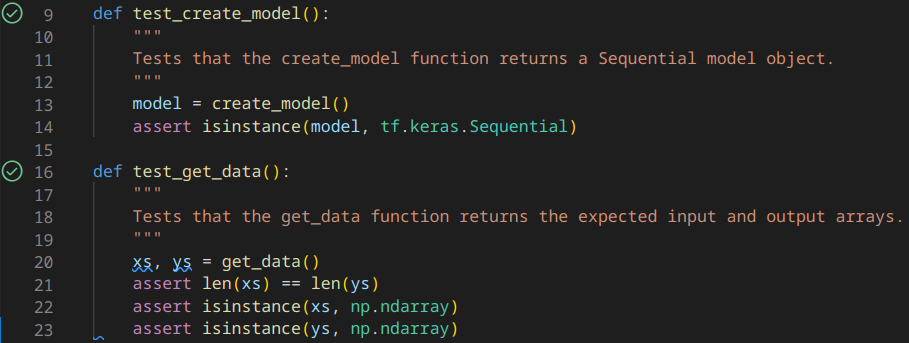
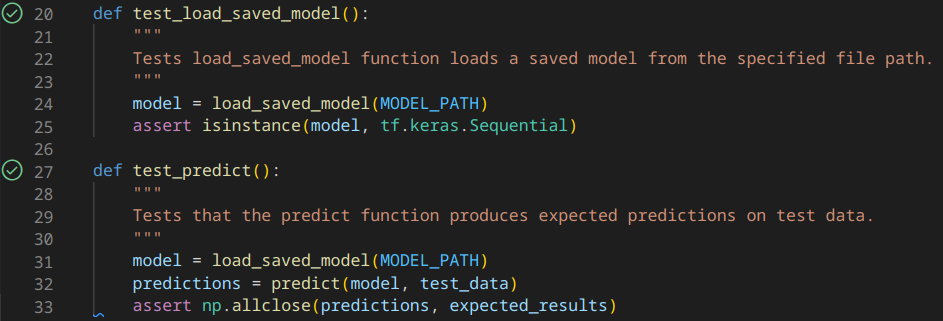
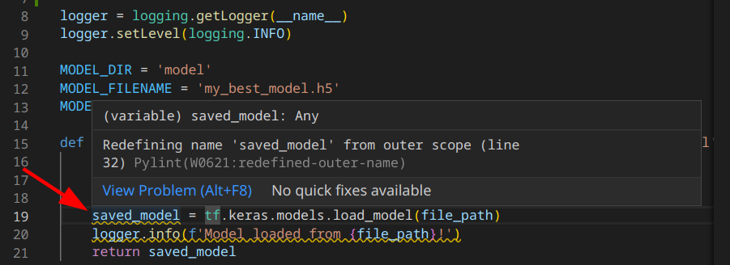
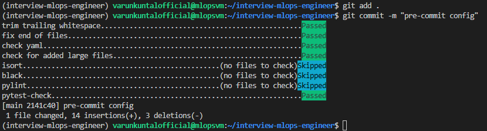
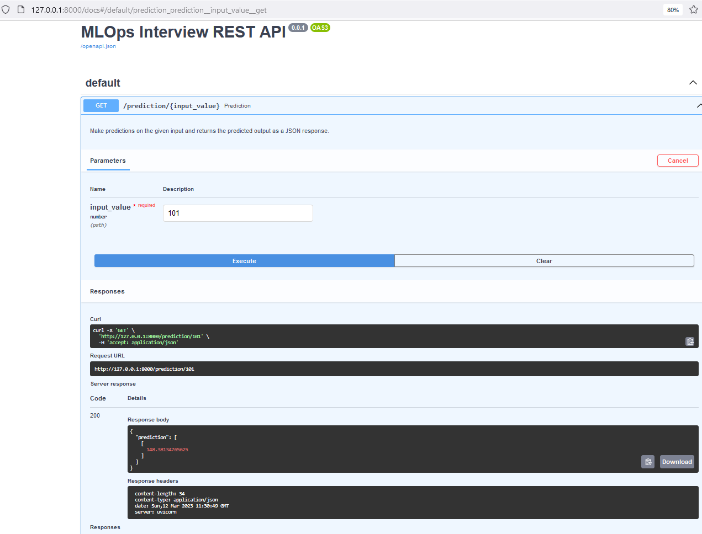

# MLOps Engineer Interview Project

### **High level spec**

Data Scientist team created a Jupyter notebook `My Best Model.ipynb` that contains all the code to train, save, load and inference.
Your task is to create a REST API in python that serves the model and allows for online inference.
You should create 1 endpoint that accepts relevant input and returns the infernece results to the client.

-----

### **How to share your results?**
- [ ] Clone this repository and create your own branch to work on.
- [ ] .... develop .....
- [ ] Once you are ready, create a pull request with your code.


### **Evaluation:**
- [ ] There should be **at least** one test written and the README file should include instructions on how to execute it.
- [ ] You should provide clear documentation of the API, you can use Swagger or any other format.
- [ ] README file should include clear instructions on how to deploy / start the application.
- [ ] No crashes or bugs.
- [ ] Code is easily understood and communicative (eg. comments, variable names, etc).
- [ ] Everything that you decide to not do due to the limitation of time should be documented in the README.
- [ ] GitHub commit history is consistent, easy to follow and understand.

---

Index
-----

*   [Project Implementation](#project-implementation)
*   [Terraform](#terraform)
*   [Creating a Virtual Environment with Python 3.10](#creating-a-virtual-environment-with-python-310)
*   [Creating python scripts from notebook](#creating-python-scripts-from-notebook)
*   [Unit Tests](#unit-tests)
*   [Instructions to execute tests](#instructions-to-execute-tests)
*   [Linting & Formatting](#linting--formatting)
*   [Pre-commit hooks](#pre-commit-hooks)
*   [REST API with FASTAPI & OpenAPI Docs](#rest-api-with-fastapi--openapi-docs)
*   [Instructions to Deploy / Start application](#instructions-to-deploy--start-application)
*   [Future scope of project if given more time](#future-scope-of-project-if-given-more-time)

## Project Implementation

#### Scope
- Best Practices
	- Modular and reusable code
	- Testing the code
- Manage environment with pipenv
- Adding Dependencies in requirements.txt
- IaaS using Terraform on GCP
- Host Application (FASTAPI)

Google Cloud Platform was chosen to develop and deploy the REST API as they provide ~$300 credits as part of free trial & c3 high compute machine type available free for preview (as of 9th March, 2023).

### Terraform
To automate the deployment of infrastructure required for the project, Terraform was chosen. While not explicitly required, it is good practice to use an Infrastructure-as-Code (IaaC) tool like Terraform in MLOps pipelines. In case of adding more features, it will be easier to add components later on to provision more services in the cloud.

After installing terraform & gcloud utility locally on linux pc, a service account with "Owner" permissions was created in GCP & access key json was downloaded for the environment variable:

```shell
export GOOGLE_APPLICATION_CREDENTIALS="<path to access key>"
```

& authenticated API requests to Google Cloud services using following command:

```shell
gcloud auth application-default login
```

Files *variables.tf* & *main.tf* hold information on the Google Cloud project, region, zone & configuring it to create a virtual machine with ubuntu 20.04 LTS bootdisk, a vpc with firewall, ssh access, & a static ip address. Using following commands the Infrastructure was provisioned:

```shell
terraform init
terraform plan
terraform apply
terraform destroy
```

`.gitignore` was added to prevent pushing unncessary files to repo.

### Creating a Virtual Environment with Python 3.10

1. Virtual Environment was created using pipenv:
```shell
sudo apt install python3-pip
pip install pipenv
```

Since pipenv was installed in .local path, additional steps were added to include it in PATH.
```shell
echo 'export PATH=$PATH:/path to userdir/.local/bin' >> ~/.bashrc
```
Activated environment with:
```shell
source ~/.bashrc
```

2. Create new virtual environment with Python 3.10 & activating it:
```shell
sudo apt install python3.10
pipenv --python 3.10
pipenv shell
```
3. Install required dependecies as required in the code:
```shell
pipenv install tensorflow keras numpy jupyter
```

### Creating python scripts from notebook

We copy the code from the jupyter notebook and create `train.py` & `predict.py`. We could use jupyter nbconvert to achieve the same but since the code is simple we proceed with copying contents manually.

To make the code modular & resuable we divide different aspects of sript operations into individual functions.

`train.py` can be modularized into 4 different functions:

- `create_model()`: Creates a sequential neural network model with one dense layer of one unit and returns it.
- `get_data()`: Provides the data for training the neural network.
- `train_model`: Trains the neural network model on the provided data using mean squared error loss and stochastic gradient descent
- `save_model()`: Saves the provided model to the specified file (default: `model/my_best_model.h5`).

`predict.py` can be modularized into 2 different functions:

- `load_model`: Loads a saved model from the specified file (default: `model/my_best_model.h5`)
- `predict`: Uses the provided model to make predictions

We move the scripts to directory `app/`. We also create a directory `model` to store the model.

We execute the two scipts:

```shell
python train.py
python predict.py
```

Basic structure of the web application is now as given below:

```
.
├── LICENSE
├── My Best Model.ipynb
├── Pipfile
├── Pipfile.lock
├── README.md
├── app
│   ├── model
│   │   └── my_best_model.h5
│   ├── predict.py
│   └── train.py
└── terraform
    ├── main.tf
    └── variables.tf
```

To make the code more readable and for documentation purposes, docstrings were also added to each function.

Type annotations were also added for each function that add to improving code quality and can save effort in long run.

Adding logging to the modules.

### Unit Tests

We create a folder `tests` in root of the project. We use `pytest`, a popular testing framework for executing automated tests. We install pytest as a dev dependency using:

`pipenv install --dev pytest`

We add `__init__.py` file to the app directory to make it a Python package. This allows Python to recognize the folder as a package and allows to import the modules and functions inside it.

We add 4 unit tests in 2 files with 2 unit tests in each.

`test_train.py`



and `test_predict.py`



Also added test data with the expected results. Usually in a project we will have access to the actual features but currently we try to match the outputs to the predictions generated by the model in predict.py & assert they are equivalent.

### Instructions to execute tests
- Ensure environment is prepared with python 3.10.10 and pytest is installed. Navigate to root directory and execute in terminal:

`pytest tests/test_train.py` &
`pytest tests/test_predict.py`

### Linting & Formatting

#### Pylint

To improve the code quality, we use a python library called pylint which checks the code for PEP 8 style violations, such as incorrect indentations, line length, and naming conventions, unused variables, undefined names, unused imports, and more.

We start by adding pylint extension to VS Code and add pylint to the environment:

`pipenv install --dev pylint`

Pylint gave a couple of suggestions like to redefine the variable name for model to a different name for code clarity. Changes were made and now the code is mostly compliant according to pylint.



We get some useful suggestions and some not so useful suggestions. We could also add `.pylintrc` file to configure pylint suggestions, disable warnings & errors but we will skip that as the code base is simple. After applying the suggested changes, the code is almost compliant with the suggestions.

#### Black

Black is a Python code formatter that automatically formats your code according to a set of rules.

We start by installing the tool as dev dependency

`pipenv install --dev black`

Since black actually formats the code, we make sure to commit the code before we run black so in case any unwanted changes happen we can rollback.

We run command to see change suggestions from black

`black --diff .`

We found suggestions to convert single quotes to double quotes which we can ignore using `-S` to skip string normalization:

`black -S --diff .`

We found suggestions related to newlines only.


#### Isort

`isort` is a Python library used for sorting imports in Python code automatically. We start by installing the tool as dev dependency

`pipenv install --dev isort`

We see suggestions from isort:

`isort --diff .`

We accept suggestions from isort and apply them using:

`isort .`


#### Pre-commit hooks

To furthur improve upon code quality, we add pre-commit by installing:

`pipenv install --dev pre-commit`

We can automate code quality checks added earlier like isort, so we want to be notified if there are issues at the time of commit.

We define following as `pre-commit-config.yaml`:

```yaml
# See https://pre-commit.com for more information
# See https://pre-commit.com/hooks.html for more hooks
repos:
- repo: https://github.com/pre-commit/pre-commit-hooks
  rev: v4.4.0
  hooks:
    - id: trailing-whitespace
    - id: end-of-file-fixer
    - id: check-yaml
    - id: check-added-large-files
- repo: https://github.com/pre-commit/mirrors-isort
  rev: v5.10.1
  hooks:
    - id: isort
      args:
      - --profile=black
- repo: https://github.com/psf/black
  rev: 22.6.0
  hooks:
    - id: black
- repo: local
  hooks:
    - id: pylint
      name: pylint
      entry: pylint
      language: system
      types: [python]
      args: [
        "-rn",
        "-sn",
        "--recursive=y"
      ]
- repo: local
  hooks:
    - id: pytest-check
      name: pytest-check
      entry: pytest
      language: system
      pass_filenames: false
      always_run: true
      args: [
        "tests/"
      ]
```

We commit and check for violations. We get a few viollations with a warning, after fixing those, we commit again and most issues go away.



### REST API with FASTAPI & OpenAPI Docs

FastAPI is a modern, fast (high-performance), web framework for building APIs with Python 3.7+ based on the open standards for APIs: OpenAPI (formerly known as Swagger) and JSON Schema. Other alternatives for serving API include Flask, Django, Pyramid etc. We chose FASTAPI as it is fast, easy to use & handles concurrent requests.

We start by installing FASTAPI along with uvicorn which is default web server for FastAPI:

`pipenv install fastapi uvicorn`

We create an `app.py` and add an instance of FASTAPI() class called `app`

```python
app = FastAPI(title="MLOps Interview REST API",
    version="0.0.1",)
```

To prevent loading the model everytime there is a request to endpoint, we simply load the model at startup so it is in global scope.

We define a decorator with an HTTP GET method with a URL parameter `input_value`.
To handle requests asynchronously we define async function which significantly improve the server's performance and throughput, particularly when dealing with long-running or I/O-bound tasks.

```python
@app.get('/prediction/{input_value}')
async def prediction(input_value: float):
    """
    Make predictions on the given input and returns the predicted output as a JSON response.
    """
    predicted_output = tf_model.predict([[input_value]])
    logger.info(f'API called, prediction: {predicted_output}')
    return jsonable_encoder({'prediction': predicted_output.tolist()})
```

For the prediction endpint above, the valid input is a single float value passed as a path pareameter to `/predidction/{input_value}`. The input shape is a 2D array of shape `(1,1)` & output is a JSON string with a key-value pair with shape `(1,1)` consistent with input shape.

We open OpenAPI docs url `http://127.0.0.1:8000/docs` for sending an HTTP get request to endpoint `/prediction/{input_value}`. We get a JSON response of prediction endpoint.




### Instructions to Deploy / Start application

- Clone the repository. Install python 3.10 in your system, verify python version with

`which python`

Keep the path handy.

- Install pipenv in the system, we will use it to install dependencies in `Pipfile.lock`. Instructions to install pipenv are given at beginning of this README file.

- Install production dependencies using:

`pipenv install --ignore-pipfile --deploy`

- Start the FASTAPI uvicorn web server by simply executing:

`uvicorn app.app:app --reload`

- Navigate to the url to test the api endpoint:

`http://127.0.0.1:8000/docs`

- In the GET /prediction/{input_value}, give a single number to test the endpoint and press execute.


### Future scope of project if given more time

- Adding an experiment tracking, data versioning, model management, reproducibility and collaboration tools like MLFlow, Kubeflow etc
- Adding open source monitoring & alerting tools like Prometheus & Grafana.
- Dockerizing the application to deploy on serverless services like GCP Cloud Run, Azure Web Service or AWS Lambda.
- Adding integration tests for the different components with best practices using docker compose.
- Using Github actions to automate end-to-end lifecycle with CI/CD best practices.
- AutoML tools like Google Cloud AutoML in Vertex AI to automate the model selection, hyperparameter tuning, and feature engineering process 
